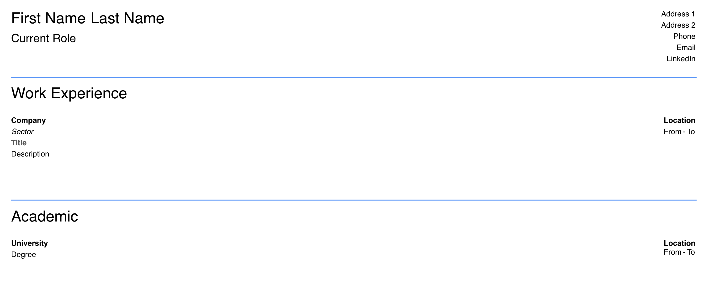

# odin-weather-app

### Interactable CV document

## Access the page [here](https://benjamin-albarzendji.github.io/odin-cv-app/)

### Description
This is my first project using ReactJS in a component based manner. The interface is fully editable (as a document would be), with the ability to add several jobs and educations via buttons appearing when hovering the appropiate section. Apart from that, there is not that much else to it.  

### Project Technologies:
* CSS 
* HTML
* JavaScript
* ReactJS
* Webpack

